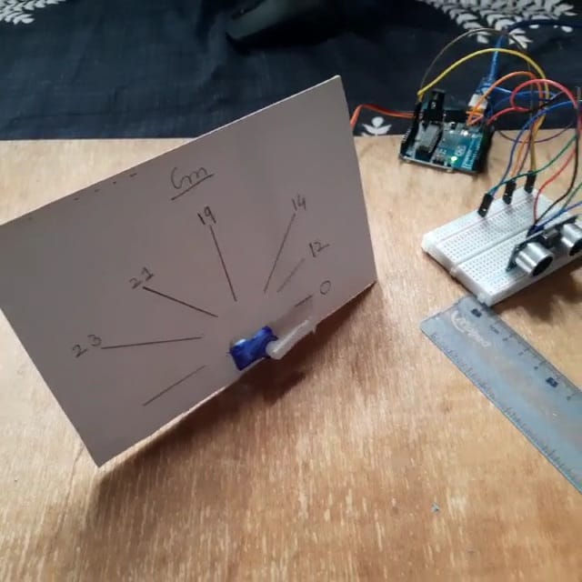

# Servo-Distance_Indicator

# Code 

 Pin.no must be followed properly while constructing the circuit 
 
# Output 

 It Measures Distance & Indicate it in Servo motor based Odometer(device used for measuring distance) in Centimeter(Cm) 
